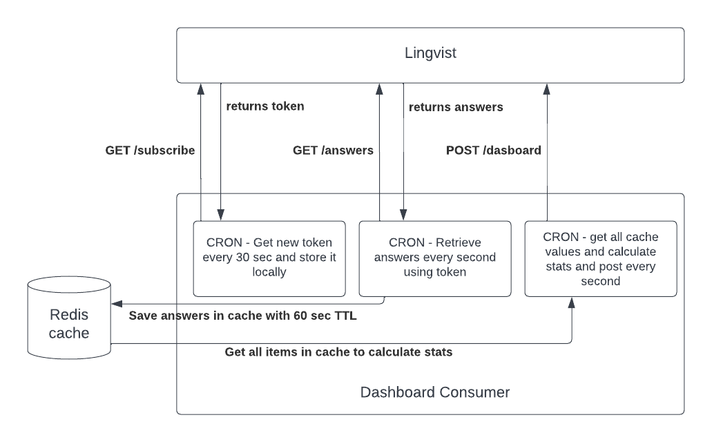

# TEST TASK FOR LINGVIST

## Requirements

-   Redis - you need to have Redis installed and server running locally at your machine. For mac install `brew install redis` and `redis-server` to start locally.
-   Node 16 (follow `.nvmrc`, just run `nvm use`)
-   NPM 8+

## Development

-   Install dependencies `npm i`
-   To run service in dev environment, use `npm start`

## Technical Notes

- The server is running with [nodemon](https://nodemon.io/) which will automatically restart for you when you modify and save a file.

## API

-   This service does expose any API endpoints.

## Flowchart

## Time

-   Total time spent on this exercise - around 6.5h
-   Most challenging part was setting up redis, storing and retrieving useable data